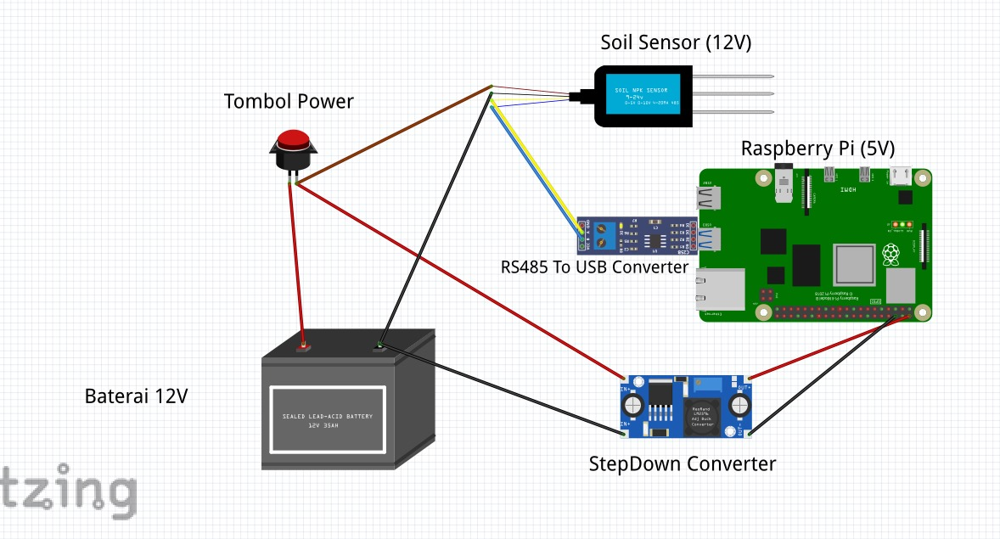

# Soil Station 2.0

## **Deskripsi Proyek**

Proyek ini adalah perangkat keras dan software yang merupakan aplikasi desktop untuk pengukuran dan pencatatan data tanah (soil) menggunakan sensor NPK (Nitrogen, Fosfor, Kalium) dan modul GPS. Aplikasi ini dirancang untuk berjalan pada perangkat Raspberry Pi atau perangkat serupa dengan layar sentuh. Aplikasi ini memungkinkan pengguna untuk mengumpulkan dan menyimpan data tanah serta lokasi secara efisien.

## **Fitur Utama**

- **Pengukuran Data Tanah**: Mengukur kadar Nitrogen, Fosfor, dan Kalium dalam tanah.
- **Pengumpulan Data GPS**: Mengumpulkan koordinat lokasi titik pengukuran.
- **Antarmuka Pengguna**: Antarmuka yang intuitif dan mudah digunakan untuk menampilkan data yang terkumpul.
- **Penyimpanan Data**: Menyimpan data pengukuran dan lokasi ke dalam database untuk analisis lebih lanjut.

## **Informasi Pengguna**

- **Pengguna**: Proyek ini ditujukan untuk pengguna yang ingin mengukur dan mencatat data tanah menggunakan Raspberry Pi dan sensor NPK hasil pengukuran kemudian dikirimkan ke server backend untuk menindak lanjuti pemrosesan lebih lanjut.
- **Keterampilan yang Diperlukan**: Pengetahuan dasar tentang Raspberry Pi, Python, dan pengaturan perangkat keras.